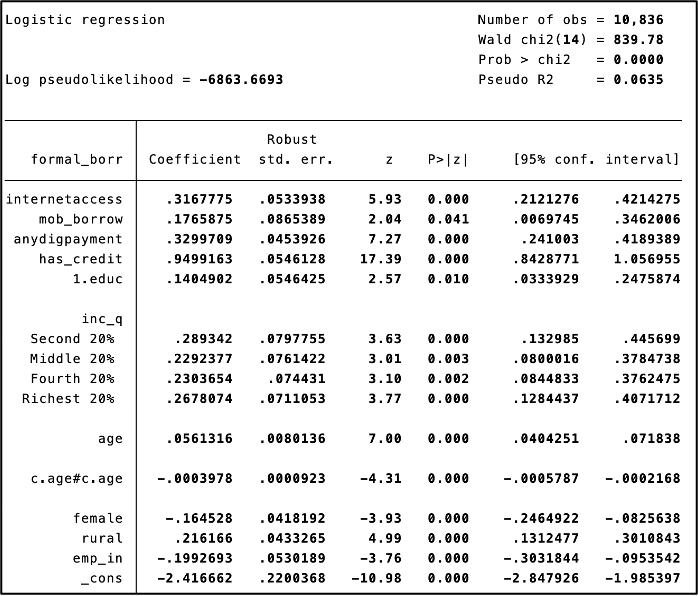
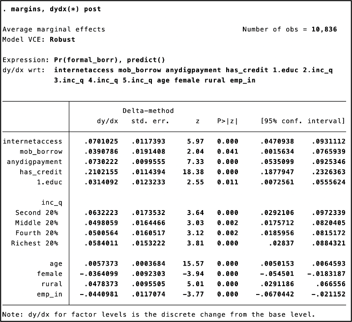
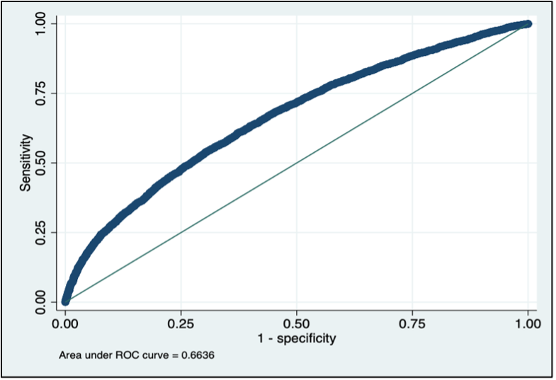
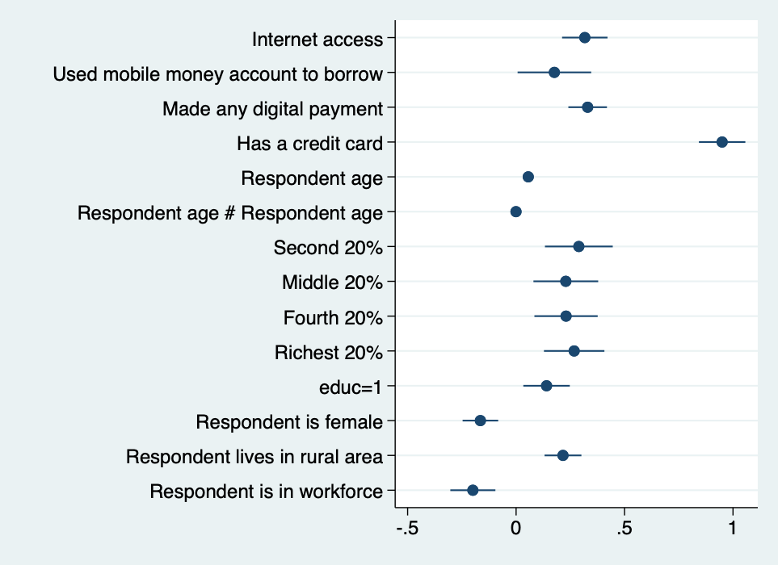

# Digital Access and Formal Borrowing Decisions  
### Logit Analysis using World Bank FINDEX Microdata (Stata)

## Overview
This project analyses how digital access, education, income, and demographic factors
influence an individual’s likelihood of borrowing from formal financial institutions.
Using individual-level survey data from the World Bank Global FINDEX (2021),
a logistic regression (Logit) framework is applied to model formal borrowing behaviour.

The study focuses on whether digital financial tools act as a gateway
from informal to formal credit sources.

## Data
- **Source:** World Bank Global FINDEX Database (2021)
- **Coverage:** ~145,000 individuals across 139 economies
- **Nature:** Cross-sectional, nationally representative survey data

**Dependent variable**
- Formal borrowing  
  (1 = borrowed from formal institutions, 0 = informal sources)

**Key explanatory variables**
- Internet access  
- Digital payment usage  
- Mobile-based borrowing  
- Credit card ownership  
- Education level (tertiary vs non-tertiary)  
- Income quintiles  

**Controls**
- Age and age-squared  
- Gender  
- Rural/urban residence  
- Employment status  

> Raw FINDEX data are not uploaded due to licensing restrictions.  
> Replication logic and variable construction are documented in the code files.

## Methodology
- Binary choice modelling using **Logistic Regression (Logit)**
- Robust standard errors to account for heteroskedasticity
- Interpretation via **Average Marginal Effects**

**Model diagnostics include** 
- Pseudo R-squared
- Wald chi-square test   
- Hosmer–Lemeshow goodness-of-fit test  
- ROC curve and Area Under the Curve (AUC)
- Variance Inflation Factors (VIF)
- Coefficient 

## Key Findings
- Digital access significantly increases the probability of formal borrowing.
- Credit card ownership has the strongest effect, increasing formal borrowing
  probability by approximately **21 percentage points**.
- Internet access and digital payment usage raise borrowing likelihood
  by around **7 percentage points**.
- Higher education and income levels are positively associated with formal credit use.
- Formal borrowing increases with age for younger individuals, peaking at middle-age and starts to 
  decline at higher ages.  
- Women are less likely to borrow formally than men, controlling for other factors.
- The model demonstrates moderate discriminatory power (**AUC ≈ 0.66**) and acceptable fit (H-L test
  has a p-value ≈ 0.22 > 0.01).

## Key Outputs

### Logit Regression Results

### Average Marginal Effects

### ROC Curve

### Coefficient Plot (Log-Odds)

## Policy Implications
- Expanding digital infrastructure can improve access to formal credit
- Early financial touchpoints (e.g., credit cards) act as gateways to broader financial inclusion
- Targeted digital financial literacy initiatives are crucial
- Gender-sensitive credit products may help reduce borrowing gaps

## Limitations
- The analysis is based on cross-sectional survey data and identifies associations rather than
causal effects.
- Formal borrowing behaviour is self-reported & may be subject to reporting or recall bias.
- Although the model includes key factors affecting formal credit, other factors like
psychological biases and cultural preferences have not been added, raising the possibility
of omitted variable bias.
- Informal and cash-dependent borrowers may be underrepresented in the survey data,
potentially underestimating issues faced by financially underserved populations.

## Conclusion
Using individual-level World Bank FINDEX data, this project applies a logistic regression framework 
to study formal borrowing behaviour. The results show that digital access—particularly internet usage 
and digital payment adoption—significantly increases the probability of borrowing from formal credit sources, 
even after controlling for income and education. Credit card ownership emerges as the strongest predictor of 
formal borrowing, while notable gaps persist across demographic groups. Model diagnostics, including an ROC AUC 
of approximately 0.66 and the Hosmer–Lemeshow test, indicate adequate predictive performance. Overall, the 
findings highlight the positive role of digital access in promoting formal financial inclusion, while underscoring 
the continued need for targeted policy interventions to address structural barriers.

## Tools
- Stata  
- World Bank FINDEX

## Code
The analysis is fully reproducible using the following Stata do-files:

- [`01_Data_cleaning.do`](code/01_Data_cleaning.do) – Data cleaning and variable construction  
- [`02_Logit_and_margins.do`](code/02_Logit_and_margins.do) – Logit estimation and marginal effects  
- [`03_Model_diagnostics.do`](code/03_Model_diagnostics.do) – Multicollinearity, ROC curve, and goodness-of-fit tests  
## Full Report
The complete project report, including data description, methodology, results,
policy implications, and limitations, is available here:

📄 [Applied Econometric Analysis using Logistic Regression – PDF](report/Logit_Analysis_Stata.pdf)

## Author
**Abhinayaa Kumar Subramanian**  
- MSc Applied Economics
- National University of Singapore
